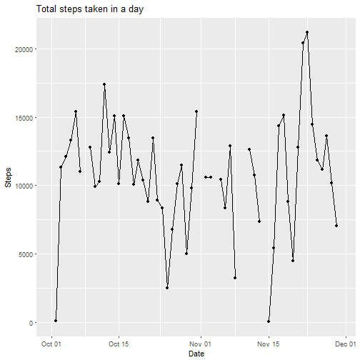

## Summary
For this project we will be investigating data recorded by a personal activity monitoring device. This device collects the number of steps taken in five-minute intervals from 1 October 2012 through 30 November 2012.

Metadata, as per the coursera page:

>The variables included in this dataset are:  
***steps***: Number of steps taking in a 5-minute interval (missing values are coded as NA)  
***date***: The date on which the measurement was taken in YYYY-MM-DD format  
***interval***: Identifier for the 5-minute interval in which measurement was taken  
The dataset is stored in a comma-separated-value (CSV) file and there are a 
total of 17,568 observations in this dataset.

### Setup 

Specify the working directory and load all the libraries we'll need for this project.


```r
setwd("C:/Users/AngelSparkles/Documents/Coursera/Reproducable Research/Week 2/Project/")
library(dplyr)
library(stringr)
library(ggplot2)
library(scales)
```


Now read the data into a dataframe. We'll name the raw dataframe *data*

```r
data<-read.csv(unz('repdata%2Fdata%2Factivity.zip','activity.csv'),header=TRUE)
```

### Data Cleanup

The interval field needs to have leading zeros
so that it can be parsed easier and converted to a timestamp value

```r
data$time<-str_pad(data$interval,4,pad='0')
```

Combine the date field and the newly-created time field and create a POSIX time field named **timestamp**

```r
data$timestamp<-as.POSIXct(paste(data$date,data$time),format="%Y-%m-%d %H%M")
head(data)
```

```
##   steps       date interval time           timestamp
## 1    NA 2012-10-01        0 0000 2012-10-01 00:00:00
## 2    NA 2012-10-01        5 0005 2012-10-01 00:05:00
## 3    NA 2012-10-01       10 0010 2012-10-01 00:10:00
## 4    NA 2012-10-01       15 0015 2012-10-01 00:15:00
## 5    NA 2012-10-01       20 0020 2012-10-01 00:20:00
## 6    NA 2012-10-01       25 0025 2012-10-01 00:25:00
```

```r
mean5min<-mean(data$steps,na.rm=TRUE)
meanHour <- mean5min*12
```
## What is the mean total number of steps taken per day?

```r
#Aggregate: Sum the total steps taken on each day
stepsPerDay<-group_by(data,date)
totalStepsPerDay<-summarise(stepsPerDay, total=sum(steps))
#Get the mean value of the total steps taken each day
StepsmeanDay<-mean(totalStepsPerDay$total,na.rm=T)
#Get the mean value of the total steps taken each day
StepsmedianDay<-median(totalStepsPerDay$total,na.rm=T)
print(paste("The wearer took a mean value of",as.integer(StepsmeanDay),"steps each day."))
```

```
## [1] "The wearer took a mean value of 10766 steps each day."
```

```r
print(paste("The median value is",as.integer(StepsmedianDay),"steps."))
```

```
## [1] "The median value is 10765 steps."
```
### Let's visualize the wearer's steps per day over two months.

First we'll plot their daily activity.

```r
#convert the date field to POSIX
totalStepsPerDay$date<-as.POSIXct(totalStepsPerDay$date)
ggplot(data=totalStepsPerDay,aes(date,total,group=1))+
  geom_point(color='black')+
  geom_line(color='black')+
  ggtitle("Total steps taken in a day")+
  xlab("Date")+
  ylab("Steps")
```

```
## Warning: Removed 8 rows containing missing values (geom_point).
```

```
## Warning: Removed 2 rows containing missing values (geom_path).
```



#### Now let's look at the distribution of steps taken each day with a histogram.

We'll use 11 bins for this dataset, which means the bin width is ~2000 steps.


```r
ggplot(data=totalStepsPerDay,aes(total))+geom_histogram(bins=11)+ggtitle("Steps taken in a day")+xlab("Number of Steps")+ylab("Number of Days")
```

```
## Warning: Removed 8 rows containing non-finite values (stat_bin).
```


## Daily Activity Pattern

### Plot all the data by time of day with a mean value line overlaid

```r
ggplot(data,aes(as.POSIXlt(data$time,format="%H%M"),(data$steps)))+
  geom_point(alpha=0.1,color='black')+
  xlab("Time of Day")+
  ylab("Steps Taken")+
  ggtitle("Steps Taken by Time of Day: 10.01.2012 - 11.30.2012")+
  scale_x_datetime(breaks=date_breaks("2 hours"),labels=paste0(seq(-2,26,2),":00"))+
  stat_summary(aes(y = (data$steps),group=1), fun.y=mean, colour="red", geom="line",group=1)
```

```
## Warning: Removed 2304 rows containing non-finite values (stat_summary).
```

```
## Warning: Removed 2304 rows containing missing values (geom_point).
```


### Now plot the mean number of steps taken at a given time interval  

```r
ggplot(data,aes(as.POSIXlt(data$time,format="%H%M"),(data$steps)))+
  xlab("Time of Day")+
  ylab("Steps Taken")+
  ggtitle("Average Steps Taken by Time of Day: 10.01.2012 - 11.30.2012")+
  scale_x_datetime(breaks=date_breaks("2 hours"),labels=paste0(seq(-2,26,2),":00"))+
  stat_summary(aes(y = (data$steps),group=1), fun.y=mean, colour="red", geom="line",group=1)
```

```
## Warning: Removed 2304 rows containing non-finite values (stat_summary).
```


### On average, during what time of day are the most steps taken?

```r
#Group the data by time of day
stepsPerTime<-group_by(data,interval)
#Find the mean number of steps taken at each time of day interval
meanStepInterval<-summarise(stepsPerTime, mean=mean(steps,na.rm=T))
#arrange summary data so the first record contains the max value of steps
maxSteps<-(arrange(meanStepInterval,desc(mean))[1,])
#get and format the max steps
maxStepsCount<-as.integer(maxSteps$mean)
#get and format the time of max steps
maxStepsTime<-str_pad(maxSteps$interval,4,pad='0')
print(paste("On average, the most active time of day is",paste0(substr(maxStepsTime,0,2),':',substr(maxStepsTime,3,4)),"and, on average, the wearer takes",maxStepsCount,"steps."))
```

```
## [1] "On average, the most active time of day is 08:35 and, on average, the wearer takes 206 steps."
```

## Dealing with missing values

### How many intervals have missing data?

```r
print(paste("This dataset contains",sum(is.na(data)),"missing values."))
```

```
## [1] "This dataset contains 2304 missing values."
```
#### These missing values may be caused by either the device being turned off or not worn during these time intervals. 

My strategy for filling in these missing values is to use the wearer's average number of steps taken during the missing value's interval. For example, at the  08:35 interval, the wearer, on average, takes 206 steps. If there is a missing value at this interval, I will replace the NA with 206.


```r
#first, lets look at the raw data
head(data)
```

```
##   steps       date interval time           timestamp
## 1    NA 2012-10-01        0 0000 2012-10-01 00:00:00
## 2    NA 2012-10-01        5 0005 2012-10-01 00:05:00
## 3    NA 2012-10-01       10 0010 2012-10-01 00:10:00
## 4    NA 2012-10-01       15 0015 2012-10-01 00:15:00
## 5    NA 2012-10-01       20 0020 2012-10-01 00:20:00
## 6    NA 2012-10-01       25 0025 2012-10-01 00:25:00
```

```r
#join the averge interval vlaues to the raw dataset
joined<- left_join(data,meanStepInterval,by='interval')
#Now, whereever the data is NA, replace with the mean time value
joined[is.na(joined),]$steps<-joined[is.na(joined),]$mean
newData<-select(joined,steps:timestamp)
head(newData)
```

```
##       steps       date interval time           timestamp
## 1 1.7169811 2012-10-01        0 0000 2012-10-01 00:00:00
## 2 0.3396226 2012-10-01        5 0005 2012-10-01 00:05:00
## 3 0.1320755 2012-10-01       10 0010 2012-10-01 00:10:00
## 4 0.1509434 2012-10-01       15 0015 2012-10-01 00:15:00
## 5 0.0754717 2012-10-01       20 0020 2012-10-01 00:20:00
## 6 2.0943396 2012-10-01       25 0025 2012-10-01 00:25:00
```

## Now what is the mean total number of steps taken per day?

```r
NEWstepsPerDay<-group_by(newData,date)
NEWtotalStepsPerDay<-summarise(NEWstepsPerDay, total=sum(steps))
#Get the mean value of the total steps taken each day
NEWStepsmeanDay<-mean(NEWtotalStepsPerDay$total,na.rm=T)
#Get the mean value of the total steps taken each day
NEWStepsmedianDay<-median(NEWtotalStepsPerDay$total,na.rm=T)
print(paste("The wearer took a mean value of",as.integer(NEWStepsmeanDay),"steps each day."))
```

```
## [1] "The wearer took a mean value of 10766 steps each day."
```

```r
print(paste("The median value is",as.integer(NEWStepsmedianDay),"steps."))
```

```
## [1] "The median value is 10766 steps."
```
### Let's visualize the wearer's steps per day over two months.

First we'll plot their daily activity.

```r
#convert the date field to POSIX
NEWtotalStepsPerDay$date<-as.POSIXct(NEWtotalStepsPerDay$date)
ggplot(data=NEWtotalStepsPerDay,aes(date,total,group=1))+
  geom_point(color='black')+
  geom_line(color='black')+
  ggtitle("Total steps taken in a day")+
  xlab("Date")+
  ylab("Steps")
```


#### Now let's revisit and look at the distribution of steps taken each day in the new dataset with a histogram.

We'll use 11 bins for this dataset, which means the bin width is ~2000 steps.


```r
ggplot(data=NEWtotalStepsPerDay,aes(total))+geom_histogram(bins=11)+ggtitle("Steps taken in a day")+xlab("Number of Steps")+ylab("Number of Days")
```


#### The data used to fill in the missing values had very little impact on the overall dataset. While it filled in gaps in the dataset, it was overall left unchanged in composition.

## Are there differences in activity patterns between weekdays and weekends?

for this last section, I will break up the data into two groups: weekdays and weekends.

```r
data$weekend<-(weekdays(data$timestamp)=='Saturday'|weekdays(data$timestamp)=='Sunday')
```

## Now plot the two categories, **weekend** and **weekday** alongside each other to visualize the difference in activity throughout the day.

```r
ggplot(data,aes(as.POSIXlt(data$time,format="%H%M"),(data$steps)))+
  xlab("Time of Day")+
  ylab("Steps Taken")+
  ggtitle("Average Steps Taken by Time of Day: 10.01.2012 - 11.30.2012")+
  scale_x_datetime(breaks=date_breaks("2 hours"),labels=paste0(seq(-2,26,2),":00"))+
  stat_summary(aes(y=data$steps,color=data$weekend),fun.y=mean, geom="line")+
  scale_color_manual(labels = c("Weekday", "Weekend"),values=c('black','red'))+
  guides(color=guide_legend("Day of Week"))
```

```
## Warning: Removed 2304 rows containing non-finite values (stat_summary).
```


#### The most siginificant differences noticed in activity between weekdays and weekends is decreased activity during morning hours(5-8AM) on the weekends and increased activity throghout the afternoon (1-6pm) on the weekends.
